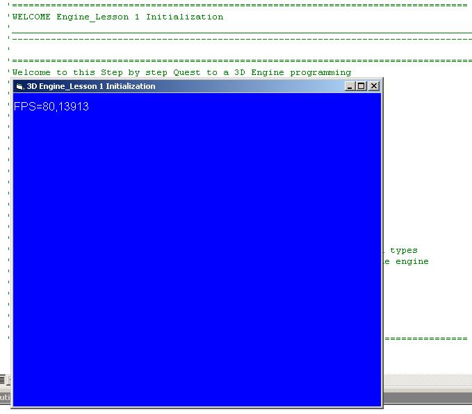



## A Step by Step Quest to 3D Engine Programming Lesson 1: initialization

### Description

This is the First tutorials of A quest for a 3D engine progamming.

This lesson #1 shows how to design the engine objects and initialize 3D device for drawing,compute frames per second.

this is a very easy readable for beginners and people who want to start 3D programming and a basic DirectX experience.

feel free to leave comments and feedback
 
### More Info
 

             |
---                |---
**Submitted On**   |2006-07-06 22:20:02
**By**             |[polaris](https://github.com/Planet-Source-Code/PSCIndex/blob/master/ByAuthor/polaris.md)
**Level**          |Beginner
**User Rating**    |4.8 (19 globes from 4 users)
**Compatibility**  |VB 5\.0, VB 6\.0
**Category**       |[DirectX](https://github.com/Planet-Source-Code/PSCIndex/blob/master/ByCategory/directx__1-44.md)
**World**          |[Visual Basic](https://github.com/Planet-Source-Code/PSCIndex/blob/master/ByWorld/visual-basic.md)
**Archive File**   |[A\_Step\_by\_200486762006\.zip](https://github.com/Planet-Source-Code/polaris-a-step-by-step-quest-to-3d-engine-programming-lesson-1-initialization__1-65885/archive/master.zip)

